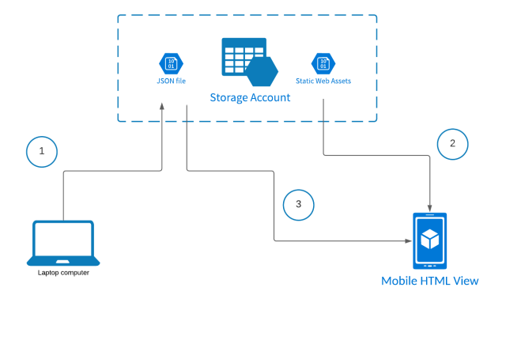
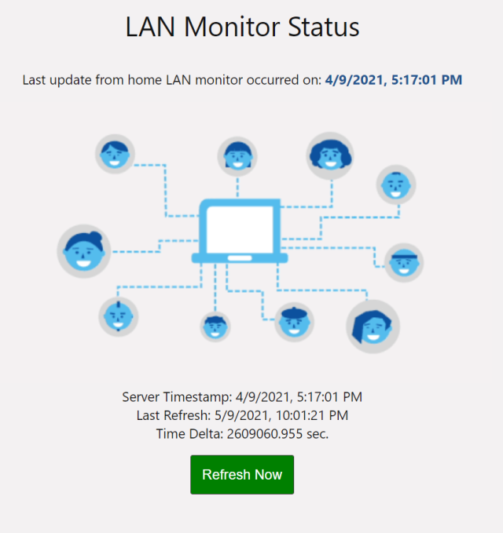
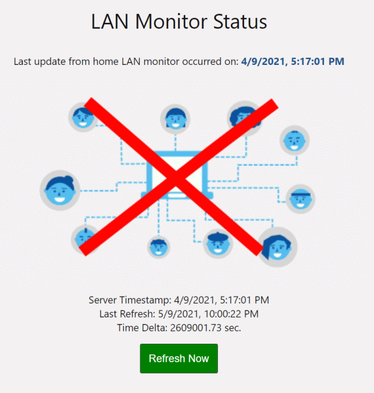

## Overview

This project was done as a quick solution to detecting when the utility company 
was going to turn the power back on to my home office. While there are of course many
solutions I could have taken to check if my router / workstation(s) were up (e.g., 
setup a web server / outbound NAT and simply view the site), I instead gave myself a 
30-minute challenge to come up with a solution that _did not_ require inbound access 
of any kind. 

## Goals

The project goals are quite straightforward:

* Give a visual status that my home workstation(s) are up and running (and therefore my 
  router as well).
* Do NOT require any inbound access at all.
* Must be quick to develop and deploy
* Must be visibile from cell phone / laptop / etc.

## Design

The overall design I sketched out is show below:

The basic idea is as follows:

* On one of my laptops / workstations, do the following (step "1" in the diagram):
  executes a simple shell script that does the following:
  * Create a small JSON file indicating the current local date/time in ISO-8601 format.
  * Upload this JSON file to an Azure storage account container
  * Automate this process via CRON to run every minute.
* To setup monitoring, do the following:
  * Create a small, single HTML page with a bit of vanilla JS, hosted from the state `$web` 
    container on Azure storage (step "2" in the diagram)
  * The JS on the page will read the uploaded JSON file from the home machine (step "3" in the diagram)
  * The JSON file will be parsed to update/present a simple animation indicating the 
    current status of the home network as follows:
    * If it's been updated within the last minute, it's assumed up.
    * If there was been no update in 2 minutes, it's assumed down.

That's it - I think it's about as simple as I could make it.

## Deployment

To get started, first ensure the following pre-requisites are available and installed:

* The Azure CLI needs to be installed and avialable on the current path. Make sure 
  to run `az login` to set the proper security context. See installation 
  instructions [here](https://docs.microsoft.com/en-us/cli/azure/install-azure-cli).
* The `jq` utility needs to be installed and available on the current path 
  (for Ubuntu-like systems, you can use `apt-get install jq`).

Once the pre-requisites are installed, clone the repo and execute the `deploy.sh` script. 
This will create the Azure resources needed to run the solution (namely, a single resource group 
and storage account). This will also copy the HTML assets to the storage account, and you should 
be able to view the status on the URI reported to the console.

Back on the local machine, setup a CRONtab entry to run the script - and example entry 
would look like this:

` * * * * * cd /path/to/where/the/project/lives/PowerMonitor && . ./monitor.sh > monitor.log 2>&1`

This will run the `monitor.sh` file every minute (and log it's output to the `minitor.log` file as well)
for debugging info.

## Running

Once the cron job is setup and correct reporting status to the blob container, the front-end 
web app should indicate success as shown below:

Or, if the cron job is stopped, with ~2 minutes, the page should automatically reflect the network 
being down as shown below:

## Remaining Work

As this was only a 30 minute exercise, there's lots that could be cleaned up. Formatting, 
edge/error conditions, etc. I'll file issues as I find things, but as always feel free to update 
and submit any issues / PR's you would like!